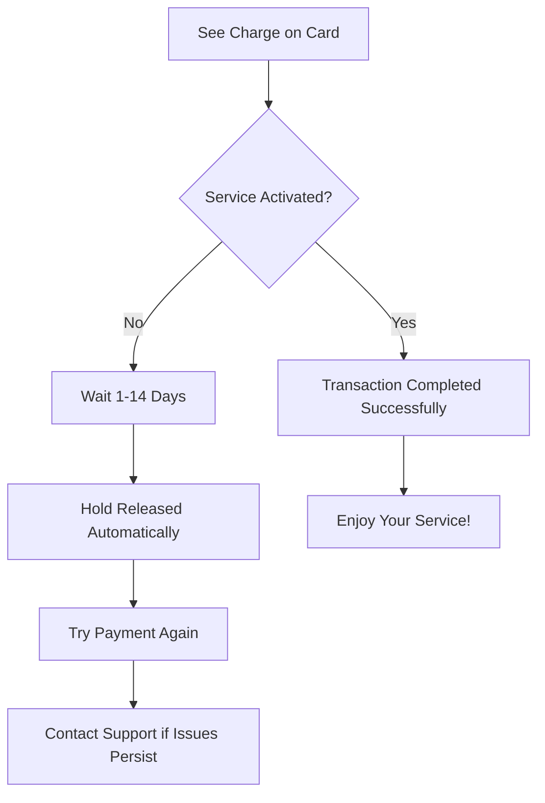

import { Step, Steps } from 'fumadocs-ui/components/steps';
import { Cards, Card } from 'fumadocs-ui/components/card';
import { Accordions, Accordion } from 'fumadocs-ui/components/accordion';
import { CreditCard, Check } from 'lucide-react';

# Pre-authorized Payments & Incomplete Transactions

**"I see a charge on my card but my service didn't activate - have I been charged?"**

This is one of the most common billing questions we receive. The short answer is: **No, you have not been charged.** What you're seeing is a pre-authorization hold, not an actual charge.

<Callout type="warn" title="Important: You Haven't Been Charged">
If your service didn't activate but you see a "charge" on your card, this is a pre-authorization hold. **Lagless.gg has not received your money** and the hold will be automatically released by your bank within 1-14 days.
</Callout>

## What Happened to My Payment?

When you see a charge on your card but your service didn't activate, here's what actually occurred:

<Steps>
  <Step>
    **Payment Attempt**
    You tried to purchase a Lagless.gg service and entered your payment details.
  </Step>

  <Step>
    **Pre-authorization Created**
    Your bank placed a temporary hold on your card to verify funds were available - this appears as a "pending" charge.
  </Step>

  <Step>
    **Transaction Failed**
    Something went wrong during processing (technical issue, verification failure, etc.) and the transaction couldn't complete.
  </Step>

  <Step>
    **Service Not Activated**
    Since the payment failed, your service wasn't activated and your account wasn't credited.
  </Step>

  <Step>
    **Money Never Transferred**
    Lagless.gg never received your money - only your bank knows about the pre-authorization hold.
  </Step>

  <Step>
    **Automatic Release**
    Your bank will automatically release the hold within 1-14 days, returning the funds to your available balance.
  </Step>
</Steps>

<Callout type="info" title="Key Point">
**We never received your money.** The "charge" you see is just your bank holding funds that will be automatically returned to you.
</Callout>

## How Long Until I Get My Money Back?

The time it takes for the pre-authorization hold to be released depends entirely on your bank or card issuer:

- **Most Common**: 1-3 business days
- **Standard Duration**: Up to 5-7 days  
- **Some Banks**: May hold for up to 14 days
- **Rare Cases**: Some issuers may hold up to 30 days

<Callout type="warn" title="We Cannot Speed This Up">
**Lagless.gg has no control over when the hold is released.** Since we never received the payment, we cannot "refund" it - only your bank can release the pre-authorization hold. Contacting us will not make this happen faster.
</Callout>

### What You'll See on Your Statement

- **Initially**: "Pending" or "Processing" charge
- **During Hold**: May show as a completed transaction (but it's not)
- **After Release**: The charge will disappear completely
- **Final Result**: Money returns to your available balance

## Why Did This Happen?

Several things can cause a payment to get stuck in pre-authorization without completing:

<Accordions>
<Accordion title="Technical Issues" id="technical">
Server problems, payment gateway timeouts, or network issues can interrupt the transaction process.

**What you see**: Pending charge on card  
**What happened**: Payment gateway couldn't complete the transaction  
**Result**: Service not activated, hold will be released automatically
</Accordion>

<Accordion title="Card Verification Failures" id="verification">
Issues with CVV verification, address verification, or fraud detection can block the transaction.

**What you see**: Pending charge on card  
**What happened**: Your bank blocked the transaction for security  
**Result**: Service not activated, hold will be released automatically
</Accordion>

<Accordion title="Insufficient Funds" id="insufficient">
If your account doesn't have enough available balance, the pre-authorization may be placed but the actual charge fails.

**What you see**: Pending charge on card  
**What happened**: Not enough funds for the full transaction  
**Result**: Service not activated, hold will be released automatically
</Accordion>

<Accordion title="Account Issues" id="account-issues">
Problems with your Lagless.gg account, payment method setup, or billing information can prevent transaction completion.

**What you see**: Pending charge on card  
**What happened**: Account verification or setup issues  
**Result**: Service not activated, hold will be released automatically
</Accordion>
</Accordions>

## What Should You Do?

### Immediate Steps

1. **Don't Panic** - You haven't been charged
2. **Check Your Service** - Look in your Lagless.gg control panel to confirm the service didn't activate
3. **Wait Patiently** - The hold will be released automatically
4. **Don't Contact Your Bank** - They can't speed up the process
5. **Try Again Later** - Once the hold is released, you can retry your purchase

<Callout type="info" title="Pro Tip">
If you're seeing multiple pending charges for the same purchase, each one is a separate pre-authorization that will be released. Don't worry - you won't be charged multiple times.
</Callout>

## How to Prevent This

### Before Making a Payment

<Cards>
  <Card
    title="Check Your Balance"
    href="/billing"
    icon={<CreditCard />}
  >
    Ensure you have sufficient available balance before attempting payment.
  </Card>
  
  <Card
    title="Verify Payment Details"
    href="/using-the-panel"
    icon={<Check />}
  >
    Double-check your card details, billing address, and CVV code.
  </Card>
</Cards>

### Best Practices

1. **Use a Stable Internet Connection** - Avoid mobile data or unstable wifi during payment
2. **Don't Click Multiple Times** - If the page is loading, wait - don't refresh or click again
3. **Check Card Status** - Ensure your card isn't expired or blocked
4. **Update Browser** - Use a modern, updated web browser
5. **Disable VPN** - Some payment processors block VPN connections

<Callout type="warn" title="Multiple Attempts">
If your first payment attempt fails, wait for the pre-authorization to be released before trying again. Making multiple attempts can result in multiple holds on your card.
</Callout>

## Common Customer Questions

### "Why does my bank statement show a charge if you didn't receive payment?"

**Answer**: Your bank statement shows a pre-authorization hold, not an actual charge. Banks often display these as "pending" transactions, which can look like completed charges but aren't. We never received the money.

### "Can you refund the charge I see on my card?"

**Answer**: We cannot refund money we never received. What you're seeing is a pre-authorization hold that only your bank can release. We have no control over this process.

### "I've been waiting a week - why haven't you refunded me?"

**Answer**: There's nothing to refund. The pre-authorization hold will be automatically released by your bank. Different banks have different timelines (1-14 days), but it will happen automatically.

### "Can I dispute this charge with my bank?"

**Answer**: You can contact your bank to ask about the hold, but disputing it won't speed up the release. The hold will be released automatically according to your bank's policies.

## Industry Standards and Regulations

Pre-authorization is a standard practice across the hosting and technology industry. According to payment industry data, [31% of all payments in 2022 were made with credit cards](https://stripe.com/au/resources/more/preauthorization-charges-on-credit-cards-what-they-are-and-how-long-they-last), making proper pre-authorization management crucial for service providers.

### Regulatory Compliance

Lagless.gg follows all applicable regulations regarding pre-authorization:

- **PCI DSS Compliance**: All payment data is handled according to Payment Card Industry standards
- **Consumer Protection**: We adhere to consumer protection laws regarding payment holds
- **Transparency**: Clear disclosure of pre-authorization policies in our terms of service

## Frequently Asked Questions

<Accordions>
<Accordion title="Will the hold be released automatically?" id="auto-release">
Yes, the pre-authorization hold will be automatically released by your bank within 1-14 days. Lagless.gg has no control over this timing.
</Accordion>

<Accordion title="Why didn't my service activate?" id="no-activation">
If you see a charge but no service activation, the payment transaction failed to complete. The "charge" is just a pre-authorization hold that will be released.
</Accordion>

<Accordion title="Can I use the same card to try again?" id="retry-card">
Yes, but wait for the current pre-authorization hold to be released first. Multiple attempts can result in multiple holds on your card.
</Accordion>

<Accordion title="What if I see multiple pending charges?" id="multiple-charges">
Each failed payment attempt creates a separate pre-authorization hold. All holds will be released automatically - you won't be charged multiple times.
</Accordion>

<Accordion title="Should I contact my bank?" id="contact-bank">
Contacting your bank won't speed up the release process, but you can call them to confirm the hold will be released automatically.
</Accordion>
</Accordions>

## Additional Resources

For more detailed information about pre-authorization charges and how they work across the payment industry, refer to [Stripe's comprehensive guide on pre-authorization charges](https://stripe.com/au/resources/more/preauthorization-charges-on-credit-cards-what-they-are-and-how-long-they-last).

<Callout type="info">
If you have specific questions about pre-authorizations on your Lagless.gg account, please [open a support ticket](https://my.lagless.gg/submitticket.php?step=2&deptid=6) with our billing support team.
</Callout>

